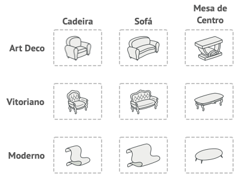

# Abstract Factory

## Propósito

O ***Abstract Factory*** é um **padrão de projeto criacional** que permite a produção de famílias de objetos relacionados sem especificar as classes concretas.

## Problema

Considere o seguinte cenário: uma loja de mobílias com a seguinte combinação: `Cadeira`, `Sofá` e `Mesa`. Cada mobília possui as seguintes variantes: `Moderno`, `Vitoriano` e `ArtDeco`.

<html>

<p><b>Figura 1</b>: Família de produtos e suas variantes.</p>
</html>

O objetivo é criar objetos de mobília individuais para que combinem com outros objetos da mesma família. Não faz sentido receber uma mobília com uma variante diferente da sua casa.

É sempre importante considerar a vantagem de um código flexível. E neste cenário, os vendedores de mobílias atualizam com frequência seu catálogo, portanto, é necessário adicionar e atualizar os produtos.

## Solução

O padrão ***Abstract Factory*** declara explicitamente interfaces para cada produto distinto da família. Assim, todas as variantes dos produtos devem implementar uma respectiva interface, que define seu núcleo comum. Seguindo o exemplo apresentado na Figura 1, é necessário definir as seguintes interfaces: `Chair`, `CoffeTable`, e `Sofa`. Cada produto final deve estender sua respectiva interface comum e implementar seu próprio comportamento.

O próximo passo consiste em declarar uma **Fábrica Abstrata**, que é uma **interface** responsável por declarar os respectivos **métodos** para a **criação** de cada tipo de produto que compõe a família. Os **métodos** são **abstratos** e o tipo de retorno é a **interface** definida no passo anterior.


<html>

<p><b>Figura 2</b>: Fábrica concreta para cada variante com <i>Abstract Factory</i>.</p>
</html>

Para cada variante de uma família de produtos é necessário criar uma classe fábrica respectiva, que deve estender a **Fábrica Abstrata**. Uma fábrica é uma classe que retornar produtos de um tipo específico.

A partir desta solução, o código cliente deve funcionar com as fábricas e seus respectivos produtos por meio das interfaces abstratas. Isso permite alterar o tipo de uma fábrica para o código cliente, bem como a variante do produto, sem quebrar o código atual.

Imagine que o cliente quer a produção de uma cadeira. O cliente não precisa saber da classe **Fábrica**, e nem que tipo de cadeira será produzida. Ele precisa saber que uma cadeira possui seus atributos e comportamentos, e independente da variante, o produto será contemplado.

## Implementação

A implementação do ***Abstract Factory*** não é definida por um algoritmo, mas pode ser observada por alguns passos:

- Os **Produtos Abstratos** declaram interfaces para um conjunto de produtos distintos, mas relacionados que compõe uma família de produtos.
- Os **Produtos Concretos** são implementações de um **Produto Abstrato**, agrupados por variantes. Cada **Produto Abstrato** deve possuir todas suas possíveis variantes implementadas.
- A **Fábrica Abstrata** declara um conjunto de métodos para a criação de cada um dos **Produtos Abstratos**.
- As **Fábricas Concretas** implementam os métodos de criação da **Fábrica Abstrata**. Cada **Fábrica Concreta** corresponde à uma variante específica de produtos.

A Figura 3 apresenta a solução arquitetural proposta pelo ***Abstract Factory***.

<html>

<p><b>Figura 3</b>: Arquitetura do <i>Abstract Factory</i>.</p>
</html>


Neste cenário, apesar das **fábricas concretas** retornarem produtos concretos, as assinaturas dos métodos retornar um tipo abstrato de produtos. Assim, o código cliente não fica ligado à uma variante específica, mas a qualquer variante do respectivo produto.

```python

from __future__ import annotations
from abc import ABC, abstractmethod

class AbstractProductA(ABC):

    @abstractmethod
    def function_a(self) -> str:
        ...

class ConcreteProductA1(AbstractProductA):

    def function_a(self) -> str:
        return "Concrete product A1"

class ConcreteProdctA2(AbstractProductA):

    def function_a(self) -> str:
        return "Concrete product A2"

class AbstractProductB(ABC):

    @abstractmethod
    def function_b(self) -> int:
        ...

    @abstractmethod
    def name(self) -> str:
        ...

class ConcreteProductB1(AbstractProductB):

    def function_b(self) -> int:
        return 1

    def name(self) -> str:
        return "Product B1"

class ConcreteProductB2(AbstractProductB):

    def function_b(self) -> int:
        return 2

    def name(self) -> str:
        return "Product B2"

class AbstractFactory(ABC):
    
    @abstractmethod
    def create_product_a(self) -> AbstractProductA:
        ...

    @abstractmethod
    def create_product_b(self) -> AbstractProductB:
        ...

class ConcreteFactory1(AbstractFactory):

    def create_product_a(self) -> AbstractProductA:
        return ConcreteProductA1()

    def create_product_b(self) -> AbstractProductB:
        return ConcreteProductB1()

class ConcreteFactory2(AbstractFactory):

    def create_product_a(self) -> AbstractProductA:
        return ConcreteProductA2()

    def create_product_b(self) -> AbstractProductB:
        return ConcreteProductB2()

def client_code(factory: AbstractyFactory) -> None:
    product_a = factory.create_product_a()
    product_b = factory.create_product_b()

client_code(ConcreteFactory1())
client_code(ConcreteFactory2())
...

```

## Exemplo Prático

Considere o seguinte cenário: uma aplicação deve suportar diferentes bancos de dados: MySQL (SQL) e MongoDB (NoSQL). Uma solução em primeiro nível por ser assim proposta:

```python

class MySQLConnection:

    def connect(self) -> None:
        print("Connecting MySQL ...")

class MongoDBConnection:

    def connect(self) -> None:
        print("Connecting Mongo DB ...")

class MySQLCommand:

    def execute(query: str) -> None:
        print("MySQL Command: " + query)

class MongoDBCommand:

    def execute(query: str) -> None:
        print("MongoDB Command: " + query)


def app():
    db = "MySQL"

    if db == "MySQL":
        connection = MySQLConnection()
        connection.connect()
        command = MySQLCommand()
        command.execute("SELECT * FROM users;")
    elif db == "MongoDB":
        connection = MongoDBConnection()
        connection.connect()
        command = MongoDBCommand()
        command.execute("{ find: 'users' }")

```

O código acima fica preso a decisões relacionadas ao tipo de conexão o comando deve usar. A adição de um novo banco de dados requer a alteração direta no código, ou seja, não está de acordo com o **Princípio de Abertura/Fechamento** do **SOLID**.

Com a refatoração do código com ***Abstract Factory***, temos:

```python

from abc import ABC, abstractmethod

class Connection(ABC):
    
    @abstractmethod
    def connect(self) -> None:
        ...

class Command(ABC):

    @abstractmethod
    def execute(self, query: str) -> None:
        ...

class DBFactory(ABC):

    @abstractmethod
    def create_connection(self) -> Connection:
        ...

    @abstractmethod
    def create_command(self) -> Command:
        ...


class MySQLConnection(Connection):

    def connect(self) -> None:
        print("Connecting MySQL ...")

class MySQLCommand:

    def execute(query: str) -> None:
        print("MySQL Command: " + query)

class MongoDBConnection(Connection):

    def connect(self) -> None:
        print("Connecting MongoDB ...")

class MongoDBCommand:

    def execute(query: str) -> None:
        print("MongoDB Command: " + query)

class MySQLFactory(DBFactory):

    def create_connection(self) -> Connection:
        return MySQLConnection()

    def create_command(self) -> Command:
        return MySQLCommand()

class MongoDBFactory(DBFactory):

    def create_connection(self) -> Connection:
        return MongoDBConnection()

    def create_command(self) -> Command:
        return MongoDBCommand()


def app():
    db = "MongoDB"

    if db == "MySQL":
        factory = MySQLFactory()
    elif db == "MongoDB":
        factory = MongoDBFactory()

    connection = factory.create_connection()
    connection.connect()

    command = factory.create_command()
    command.execute("{ find: 'users' }")


```

O código apresentado apresenta mais flexibilidade para novos tipos de banco de dados. O código fica mais organizado, com separação de responsabilidades e execução de comandos para cada tipo de banco. 

## Aplicabilidade

O ***Abstract Factory*** é adequado em cenários que o código precisa lidar com diversas famílias de produtos relacionados, porém não quer depender de classes concretas. O ***Abstract Factory*** fornece uma interface para a criação de objetos de cada classe das famílias de produtos.

Considere implementar o ***Abstract Factory*** quando existe uma classe com um conjunto de **métodos fábrica** que desfoquem sua responsabilidade principal. O **Princípio da Responsabilidade Única** defende que cada classe é responsável por uma única tarefa. Quano uma classe lida com múltiplos tipos de produto, é necessário extrair seus métodos fábrica em uma classe fábrica solitária ou com o ***Abstract Factory***.

## Discussão

Dentre as principais vantagens:
- **Compatibilidade** entre os **produtos** resultantes da **fábrica**.
- **Menor acoplamento** entre os produtos concretos e o cliente.
- **Princípio de Responsabilidade Única**: código de criação dos produtos em um lugar específico.
- **Princípio Aberto/Fechado**: facilidade para implementar novas variantes de produtos sem quebrar o código cliente existente.

## Conclusão

O ***Abstract Factory*** é um padrão de projeto criacional, que apresenta uma solução para criar famílias inteiras de produtos sem especificar suas classes concretas.

O ***Abstract Factory*** define uma **interface** para criar todos os produtos distintos, delegando a criação para classes fábricas concretas. Cada tipo de fábrica correponde a uma determinada variedade de produtos.

O código cliente chama os métodos da classe fábrica em vez de instanciar diretamente os objetos pelo construtor. Desta forma, como uma fábrica corresponde a uma única variante, todos seus produtos são compatíveis.