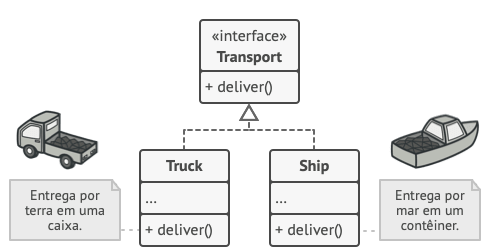
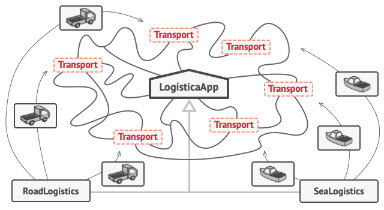

# Factory Method

## Propósito

O ***Factory Method*** (método fábrica) é um **padrão de projeto criacional** que fornece uma interface para criar objetos em uma superclasse, mas permite que as subclasses alterem o tipo de objetos que serão criados.

## Problema

Considere o seguinte cenário: existe uma aplicação de logística criada que lida com apenas o transporte por caminhões. A maior parte do código fica na classe `Caminhão`. A aplicação fica popular e passa a ser requisitada para a logística marítima.

A maior parte do código é altamente acoplada à classe `Caminhão`. Adicionar a classe `Navio` exige alteração em toda a base do código. Além disso, para todo eventual novo meio de transporte é necessário fazer alterações novamente.

Como resultado, o código-fonte fica sujo, repleto de condicionais que alteram o fluxo de execução, dependendo da classe de objetos de transporte.

## Solução

O padrão ***Factory Method*** apresenta como solução a alteração das chamadas diretas para construtores para chamadas de um método da **fábrica** especial. Os objetos ainda são criados com construtores, que são invocados dentro do método da **fábrica**. Os **objetos** retornados pelo **método** da **fábrica** são chamados de **produtos**.

Em um primeiro momento, tal mudança parece pouco justificável, pelo fato de apenas mudar a chamado do construtor para outra parte do código. No entanto, é possível sobrescrever o método fábrica em uma subclasse e alterar a classe de produtos que estão sendo instanciados.

Porém, existe uma limitação: só é possível retornar tipos diferentes de produtos no caso de ser usado uma classe ou interface comum. Além disso, o tipo de retorno deve seguir exatamente a assinatura do método declarado na **fábrica**.

No exemplo de logística, uma refatoração seria com as classes `Caminhão` e `Navio` implementando a interface `Transporte`, que define o método abstrato `transportar`. Cada classe implemente o método de acordo com sua regra de negócio própria.

A imagem a seguir apresenta a arquitetura apresentada para a solução:

A imagem apresenta a visão geral do ***Factory Method***:

A interface *Product* descreve um padrão comum à todos os objetos que podem ser produzidos pelo *Creator*, no exemplo, o método *doStuff()*. Os **Produtos Concretos** são implementações diferentes da interface do **Produto**.

A classe *Creator* representa o **Criador**, que declara o método fábrica responsável por retornar novos objetos do produto. O tipo de retorno do método *createProduct()* deve ser a interface *Product*. O método *createProduct()* pode ser declarado como abstrato para forçar as subclasses a implementarem sua própria versão.

Os **Criadores Concretos** sobrescrevem o método fábrica base para retornar um tipo diferente de **Produto**. O método fábrica não precisa retornar novas instâncias todo o tempo, mas retornar objetos armazenados em *cache* ou de outra fonte.

<html>

<p><b>Figura 1</b>: Solução proposta com o <i>Factory Method</i>.</p>
</html>

## Implementação

A implementação do ***Factory Method*** não é definida por um algoritmo, mas pode ser observada por alguns passos:

- Os **produtos** devem implementar uma **mesma interface**, que deve abstrair a declaração de métodos coerentes com o problema alvo.
- A **classe criadora** deve possuir um **método fábrica** que retorna o tipo da **interface**.
- No código da **classe criadora** encontre todas as referências aos construtores de **produtos**. Caso necessário, adicione o atributo de referência ao tipo para diferenciar os **criadores**.
- Para cada tipo de **produto**, crie uma **classe criadora** respectiva que estende a **classe criadora base** e sobrescreva o **método fábrica**. Em caso de vários tipos de produtos, organize em subclasses que agrupem tipos similares.
- Caso o **método fábrica** da **classe criadora base** ficar vazio, é recomendado torná-lo abstrato. Caso contrário, é possível deixá-lo com um comportamento padrão.

<html>

<p><b>Figura 2</b>: Diagrama com a definição do <i>Factory Method</i>.</p>
</html>

Portanto, com o ***Factory Method*** é definido um **método fábrica** para a instanciação de objetos ao invés de chamadas diretas para os construtores. A definição classe em Python é apresentada a seguir.

```python

from __future__ import annotations
from abc import ABC, abstractmethod

class Product(ABC):

    @abstractmethod
    def operation(self) -> str:
        ...

class ConcreteProduct1(Product):

    def operation(self) -> str:
        return "{Result of the ConcreteProduct1}"


class ConcreteProduct2(Product):
    
    def operation(self) -> str:
        return "{Result of the ConcreteProduct2}"

class Creator(ABC):

    @abstractmethod
    def factory_method(self) -> Product:
        ...

    def operation(self) -> str:
        product = self.factory_method()
        return product.operation()

class ConcreteCreator1(Creator):

    def factory_method(self) -> Product:
        return ConcreteProduct1()

class ConcreteCreator2(Creator):

    def factory_method(self) -> Product:
        return ConcreteProduct2()

def client_code(creator: Creator) -> None:
    ...

```

## Exemplo Prático

Considere o cenário de uma aplicação para entrega de alimentos. Existem três tipos de serviço, cada um com um método próprio para o cálculo do custo de entrega. Os três tipos de serviço de entrega são: `EntregaRapida`, `EntregaoPadrao` e `EntregaoEconomica`. O sistema precisa o valor final da entrega de acordo com o tipo escolhido pelo cliente.

A primeira forma de resolver o problema é apresentada a seguir:

```python
from abc import ABC, abstractmethod

class Delivery(ABC):

    @abstractmethod
    def get_price(self, distance: float) -> float:
        ...

class FastDelivery(Delivery):

    def get_price(self, distance: float) -> float:
        start_price: float = 10.00
        km_price: float = 5.00
        return start_price + km_price * distance

class DefaultDelivery(Delivery):

    def get_price(self, distance: float) -> float:
        start_price: float = 5.00
        km_price: float = 2.00
        return start_price + km_price * distance

class EconomicDelivery(Delivery):

    def get_price(self, distance: float) -> float:
        start_price: float = 2.00
        km_price: float = 1.00
        return start_price + km_price * distance

def create_order(delivery_type: str, distance: float) -> float:
    if delivery_type == "fast":
        delivery = FastDelivery()
    elif delivery_type == "default":
        delivery = DefaultDelivery()
    elif delivery_type == "economic":
        delivery = EconomicDelivery()
    else:
        raise ValueError("Delivery Type not found")
    return delivery.get_price(distance)
```

No exemplo, a cada novo tipo de entrega é necessário modificar o código em vários pontos, com o código (`if-else`) incluso na regra de negócios.

O exemplo a seguir apresenta a refatoração com a aplicação do `Factory Method`:

```python

from abc import ABC, abstractmethod

class Delivery(ABC):

    @abstractmethod
    def get_price(self, distance: float) -> float:
        ...

class FastDelivery(Delivery):

    def get_price(self, distance: float) -> float:
        start_price: float = 10.00
        km_price: float = 5.00
        return start_price + km_price * distance

class DefaultDelivery(Delivery):

    def get_price(self, distance: float) -> float:
        start_price: float = 5.00
        km_price: float = 2.00
        return start_price + km_price * distance

class EconomicDelivery(Delivery):

    def get_price(self, distance: float) -> float:
        start_price: float = 2.00
        km_price: float = 1.00
        return start_price + km_price * distance

class DeliveryFactory:
    
    @staticmethod
    def create_delivery(delivery_type: str) -> Delivery:
        if delivery_type == "fast":
            return FastDelivery()
        if delivery_type == "default":
            return DefaultDelivery()
        if delivery_type == "economic":
            return EconomicDelivery()
        raise ValueError("Delivery Type not found")

def create_order(delivery_type: str, distance: float) -> float:
    delivery = DeliveryFactory(delivery_type)
    return delivery.get_price(distance)
```

Com a refatoração, temos os seguintes benefícios:

- **Centralização**: a **classe criadora** (*DeliveryFactory*) é responsável por acoplar a lógica para a instanciação de objetos;.
- **Flexibilidade**: um novo tipo de entrega exige a implementação de uma nova classe e a respectiva inclusão de código na fábrica (*DeliveryFactory*).
- **Manutenção**: código modular, com a lógica de criação isolada na classe *DeliveryFactory*.

<html>

<p><b>Figura 3</b>: Visão geral do problema e solução proposta.</p>
</html>

## Discussão

O ***Factory Method*** é adequado quando não é possível saber previamente os tipos e dependências exatas dos objetos que o código deve funcionar. O ***Factory Method*** separa o código de instanciação do produto do código que utiliza o produto. Assim, é mais fácil estenter o código de construção, independendente do restante do código.

O ***Factory Method*** é adequado quando é necessário fornecer aos usuários da biblioteca uma maneira de estender componentes internos. Usualmente, a **herança** é o conceito mais apropriado para estender o comportamento padrão. A solução é reduzir o código em um único método fábrica e permitir a sobrescrita desse método pela extensão do componente.

O ***Factory Method*** é útil para economizar recursos do sistema reutilizando objetos existentes. Requisito comum em sistemas com conexões com banco de dados, arquivos extensos de texto, etc. A abstração da instanciação de objetos extensos e a reutilização desses objetos é conveniente com o uso do método fábrica.

## Conclusão

Como benefícios é possivel destacar:

- **Menor acoplamento** entre o **criador** e os **produtos concretos**.
- **Princípio de responsabilidade única**: o código de instanciação de produtos é localizado em um único lugar, facilitando a manutenção.
- **Princípio aberto/fechado**: a introdução de novos tipos de produtos não interfere no código existente.

Porém, é preciso atenção para não tornar o código mais complexo que o necessário. Em especial, na **criação** de **subclasses** para o **produto** e **criador**. O melhor cenário é a adição de novas classes em uma arquitetura definida e organizada.
